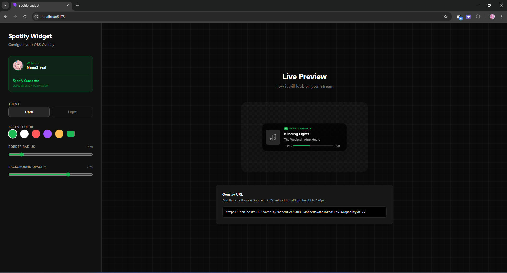
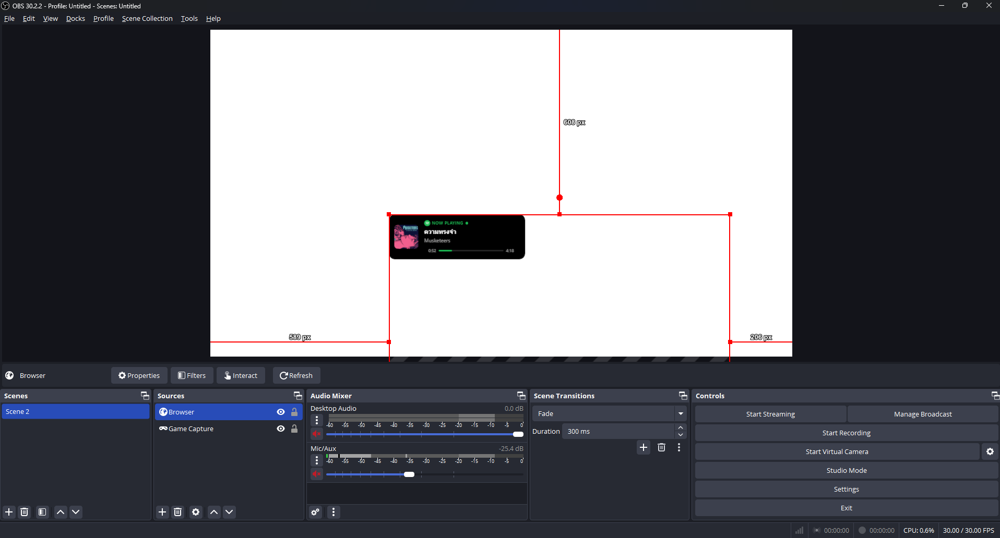

# 🎵 Spotify Now Playing Widget for OBS

A sleek, customizable, and high-performance "Now Playing" overlay for streamers. Built with **React**, **TypeScript**, **Tailwind CSS**, and a secure **Node.js/Express** backend.

---

## ✨ Features

- **Live Sync**: Real-time polling of your Spotify playback.
- **Visual Customizer**: Personalize your widget with a live preview before adding it to OBS.
- **Customizable Themes**: Toggle between Dark and Light modes.
- **Style Controls**: Adjust accent colors, border-radius, background opacity, and blur.
- **Privacy-First**: Secure backend handling for Spotify OAuth credentials.
- **OBS Optimized**: Designed specifically for high-performance browser sources with perfect transparency.

---

## 🖼️ Preview

### Configuration Interface


### Live in OBS


---

## 🚀 Quick Start

### 1. Spotify Developer Setup
- Go to the [Spotify Developer Dashboard](https://developer.spotify.com/dashboard).
- Create a new App.
- Add `http://127.0.0.1:3001/api/callback` to the **Redirect URIs** section.
- Copy your **Client ID** and **Client Secret**.

### 2. Local Configuration
Create a `.env` file in the root directory:

```env
SPOTIFY_CLIENT_ID=your_client_id_here
SPOTIFY_CLIENT_SECRET=your_client_secret_here
SPOTIFY_REDIRECT_URI=http://127.0.0.1:3001/api/callback
PORT=3001
```

### 3. Install & Run
```bash
# Install dependencies
npm install

# Start both Frontend and Backend
npm run dev
```

---

## 📺 Adding to OBS

1. Open the [Config Page](http://localhost:5173).
2. Connect your Spotify account.
3. Use the sliders to customize your widget.
4. **Copy the Overlay URL** from the bottom of the page.
5. In OBS, add a new **Browser Source**.
6. Paste the URL.
7. Set **Width**: `400` and **Height**: `120`.
8. Check "Shutdown source when not visible" for better performance.

---

## 🛠️ Tech Stack

- **Frontend**: Vite, React, TypeScript, Tailwind CSS v4
- **Backend**: Node.js, Express, Spotify Web API Node
- **Icons**: Lucide React

---

## 📄 License
This project is open-source and free to use!
